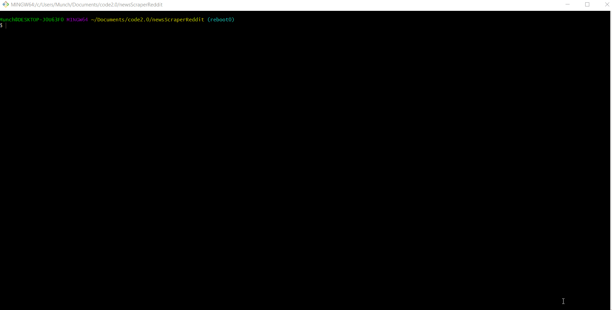

# newsScraperReddit

## Purpose:
    This app will scrape recent posts off of the /r Programming Subreddit and display them here for your viewing pleasure once they have been stored within MongoDB.

## Walkthrough:
    1) Navigate to this code file within your terminal. In the gif we're using Git Bash.
    2) Start up the server using the command "node server.js". In the gif, we confirm listening on port 3010 and confirm the connection to MongoDB via Mongoose is successful.
    3) Navigate to your webpage via your favorite browser using "localhost:3010" in the omnibox.
    4) Click the "Scrape New Reddit Articles" button.
    5) New articles are scraped, deposited into MongoDB, and regurgitated out onto the webpage.
    6) Navigate to reddit.com/r/programming to confirm they are todays articles.
    7) Check your articles are also displayed into your terminal.
    8) Enjoy successfully scraping data from America's #1 social news aggregation website.

## Technologies Used:

    CSS, Git Bash, Handlesbars.js, MongoDB, Mongoose.js, Screen To Gif

## Contact the Developer:

    The author welcomes questions, comments, and positive criticism.

    Email: Munchinator6354@gmail.com
    GitHub: https://github.com/Munchinator6354
